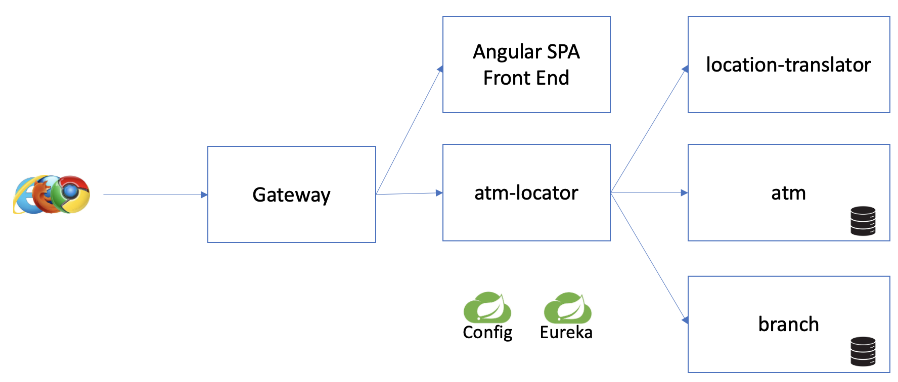

# k8s-spring-cloud-services-demo

## Description 

This project contain souce code along with configuration for build and deploying the ATM Locator application
on various platforms.  It focuses on the following environments:

- Local build: Running, testing, and coding on your local machine.
- TAP: Deploying to TAP on a Kubernetes Cluster
- Tanzu Platform for K8s: Deploying to the TP for K8s platform

This project also focuses on deploying and testing the ATM Locator application using Spring Cloud Services + Spring Cloud Gateway.  This
consists of the following services:

- Spring Cloud Gateway
- Eureka Service Registry
- Spring Cloud Config

This project demostrated how these services can be used in all of the environments (Local Dev, TAP, TP For K8s).

## ATM Locator Function Description

The ATM Locator application is a browser based application that allows a user to input a search location (full address, city/state, or just zipcode) and searches for
known ATM machines within a given radius.  The application then plots all found ATM machines on map.

## ATM Locator Architecture

The application is made up a 5 micro-services, a Spring Cloud Gateway, Eureka Service Registry, and Spring Cloud Config.  
The application consist a set of polyglot micro-services that communicate internally to implement a public search API and a frontend web application.  
The application is comprosed of the following micro-services:

* **atm-locator**: This is the primary public facing service that implements the search API; it does not require authentication.  
It acts a business logic and aggregate service that communicates with the following three internal services described below.
* **location-translator**: Internal micro-service that translates a combination of a city/state pair or a zip code into global 
coordinates (i.e. latitude and longitude). 
* **atm**: Internal micro-service that maintains a list of ATMs including their names, locations, and associations to branch locations.
* **branch**: Internal micro-service that maintains a list of bank branches including their names, locations, and operating hours.
* **atm-locator-angular**: A single page web application (SPA) written in angular that implements the frontend browser application.

The `atm-locator` public facing API is intended to be accessed by the web UI front ends to create an interactive ATM location search application.  

The high level architecture looks like the following:

 
## Environmental Scenarios

Each section below describes usage scenarios for each of the environments:

* [Local Dev](doc/LocalDev.md)
* [TAP](doc/TAP.md)
* [TP For K8s](doc/TP4K8s.md)

